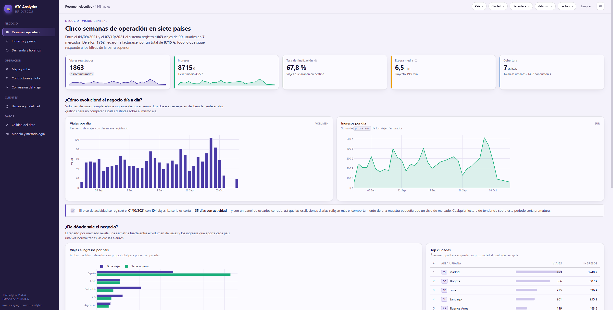
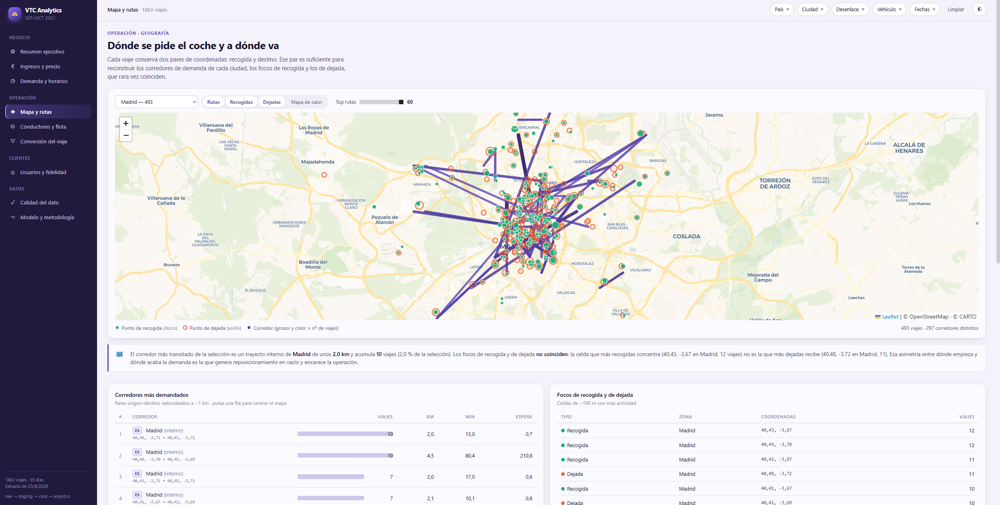

# VTC Data Engineering Analytics Challenge

### 👉 **[Ver el dashboard en vivo](https://diegoprieto23.github.io/vtc-data-engineering-analytics/report/)**

Solución completa (*end-to-end*) de **Data Engineering & Analytics** sobre un dataset de
**VTC / ride-hailing**: ingesta de los JSON en bruto, limpieza, modelado en estrella con
**dbt** sobre **PostgreSQL**, y un **informe interactivo** publicado como sitio estático.

Todo está contenerizado con **Docker**: un `docker compose up` levanta la base de datos y
ejecuta el pipeline completo.

---

## El informe interactivo


Nueve páginas agrupadas por tipo de información, con **filtros globales** (país, ciudad,
desenlace del viaje, tipo de vehículo, rango de fechas) que se propagan a todas ellas a la
vez, como el *cross-filtering* de Power BI.

<p align="center">
  
</p>

<p align="center">
  
</p>

| Sección | Página | Qué responde |
|---------|--------|--------------|
| **Negocio** | Resumen ejecutivo | KPIs, evolución diaria, reparto por mercado y ciudad |
| | Ingresos y precio | Precio en divisa local vs. normalizado a EUR, ticket, €/min, €/km |
| | Demanda y horarios | Heatmap hora local × día de la semana, espera vs. trayecto |
| **Operación** | Mapa y rutas | Corredores más demandados, focos de recogida y de dejada, heatmap |
| | Conductores y flota | Reasignaciones por viaje, concentración de la actividad, vehículos |
| | Conversión del viaje | Motivos de cierre, tasa de finalización, efecto de la espera |
| **Clientes** | Usuarios y fidelidad | Frecuencia, concentración del gasto, mercados, antigüedad |
| **Datos** | Calidad del dato | Embudo 23.919 filas → 1.863 viajes, integridad referencial |
| | Modelo y metodología | Decisiones de modelado y limitaciones declaradas |

No es una galería de gráficos: cada bloque explica **qué se está mirando y qué conclusión
admite el dato** — y cuál no. Tema claro y oscuro, responsive, y sin dependencias externas
más allá de los *tiles* del mapa.

---

## Qué hay en este repositorio

```
├── src/                  # ETL de ingesta: descompresión, parseo, carga en `raw`
├── dbt/vtc_dbt/          # Modelos dbt: staging → core → analytics
├── sql/                  # Script SQL con las vistas de analytics
├── notebooks/            # Análisis exploratorio y dashboard analítico
├── scripts/              # Exportador del extracto JSON del informe
├── report/               # Informe interactivo (sitio estático)
└── docs/                 # Documentación de arquitectura y diseño
```

**Documentación detallada:**

- **[Arquitectura y decisiones de diseño](docs/ARQUITECTURA.md)** — esquemas, modelo en
  estrella, por qué cada decisión de modelado, cómo está construido el informe y qué
  limitaciones tiene el dataset.
- **[Diseño de la arquitectura en cloud](docs/README_cloud.md)** — cómo se replicaría en
  AWS (ECS/EKS, S3, RDS, MWAA, CloudWatch, Secrets Manager).

---

## Requisitos previos

- [Docker](https://www.docker.com/) y [Docker Compose](https://docs.docker.com/compose/), o
  directamente [Docker Desktop](https://www.docker.com/products/docker-desktop), que trae ambos.
- [Python](https://www.python.org/) — solo si quieres ejecutar los notebooks o servir el
  informe en local.
- *(Opcional)* [DBeaver](https://dbeaver.io/) o cualquier cliente SQL para explorar la base de datos.

Para los notebooks hace falta instalar las dependencias:

```bash
pip install -r requirements.txt
```

---

## Configuración de las credenciales

Las credenciales **no se guardan en el repositorio**. El proyecto las lee de un fichero
`.env` local, excluido en el `.gitignore`.

Antes de la primera ejecución, copia la plantilla y rellena los valores:

```bash
cp .env.example .env
```

Después edita el `.env` y define una contraseña propia en `PG_PASSWORD`. Puedes generar una con:

```bash
openssl rand -base64 24
```

Estas variables las consumen `docker-compose.yml`, el código Python y el perfil de dbt, así
que basta con definirlas una vez. Si falta alguna, tanto Docker Compose como la aplicación
fallan al arrancar con un mensaje explícito en lugar de recurrir a un valor por defecto inseguro.

> ⚠️ Si cambias `PG_PASSWORD` con la base de datos ya creada, tendrás que recrear el volumen
> (`docker compose down -v`): la contraseña queda fijada al inicializarse el volumen de PostgreSQL.

---

## Ejecutar el pipeline

### 1. Clonar el repositorio

```bash
git clone https://github.com/DiegoPrieto23/vtc-data-engineering-analytics.git
cd vtc-data-engineering-analytics
```

### 2. Comprobar que Docker está en marcha

```bash
docker compose version
```

### 3. Ejecutar el pipeline completo

```bash
docker compose up --build
```

Esto arranca PostgreSQL, crea los esquemas (`raw`, `staging`, `core`, `analytics`), carga los
datos en bruto y ejecuta todas las transformaciones de dbt. Al terminar, los datos están
listos para explorarse.

```bash
# Ejecución puntual: más ligera, los contenedores se eliminan al acabar
docker compose run --rm app
```

### 4. Ejecutar entidades sueltas

```bash
docker compose run --rm -e PIPELINE_TARGET=drivers app
docker compose run --rm -e PIPELINE_TARGET=users   app
docker compose run --rm -e PIPELINE_TARGET=cars    app
docker compose run --rm -e PIPELINE_TARGET=trips   app
```

Cada modelo está diseñado para poder reejecutarse de forma **idempotente** N veces al día
sin generar duplicados.

### 5. Parar

```bash
docker compose down       # parar
docker compose down -v    # parar y borrar los datos
```

---

## Regenerar y ver el informe en local

El informe lee un extracto JSON versionado en `report/data/`, así que **para verlo publicado
no hace falta ni Docker ni base de datos**. Solo hay que regenerarlo si cambian los datos o
los modelos:

```bash
# 1 · Exportar el extracto desde PostgreSQL
docker compose run --rm --no-deps app python scripts/export_report_data.py

# 2 · Servir la carpeta report/
python -m http.server 8080 --directory report
#    → http://localhost:8080
```

> ⚠️ Hay que servirlo por HTTP. Abrir `report/index.html` con `file://` no funciona: el
> navegador bloquea el `fetch` de los JSON.

<details>
<summary>Ejecutar el exportador desde el host en lugar de dentro de Docker</summary>

```bash
python scripts/export_report_data.py
```

Si falla la autenticación, comprueba que no tengas **otro PostgreSQL escuchando en el
puerto 5432**: si lo hay, gana él y la conexión nunca llega al contenedor. Puedes
redirigirla sin tocar el `.env`:

```bash
PG_HOST_LOCAL=127.0.0.1 PG_PORT_LOCAL=5433 python scripts/export_report_data.py
```

</details>

---

## Publicar el informe en GitHub Pages

`report/` es un sitio estático con los datos ya incluidos, así que se publica sin más.

**Opción A — Deploy from a branch** (la configurada): en *Settings → Pages*, `main` / `root`.
El repositorio incluye un `index.html` en la raíz que redirige a `report/`, de modo que la
URL raíz del sitio abre el dashboard. También sigue accesible en
`https://<usuario>.github.io/<repositorio>/report/`.

**Opción B — GitHub Actions**: en *Settings → Pages*, elige *GitHub Actions* como *Source*.
El workflow [`.github/workflows/pages.yml`](.github/workflows/pages.yml) publica `report/`
como raíz del sitio en cada push a `main`.

---

## Explorar la base de datos

Conéctate a la instancia de PostgreSQL con DBeaver, pgAdmin o cualquier cliente SQL:

| Parámetro  | Valor                                  |
|------------|----------------------------------------|
| Host       | `localhost`                            |
| Puerto     | `5432`                                 |
| Base datos | el valor de `PG_DB` en tu `.env`       |
| Usuario    | el valor de `PG_USER` en tu `.env`     |
| Contraseña | el valor de `PG_PASSWORD` en tu `.env` |

Una vez conectado puedes recorrer las cuatro capas: `raw` → `staging` → `core` → `analytics`.

---

## Notebooks

- 🔍 **[01_exploratory_data_analysis.ipynb](notebooks/01_exploratory_data_analysis.ipynb)** —
  análisis exploratorio de `raw`: estructura, calidad, duplicados, relaciones entre entidades
  y los hallazgos que condicionaron el modelado (la unidad de cada divisa, el identificador
  placeholder, la cobertura de la dimensión de vehículos).
- 📊 **[02_analytics_dashboard.ipynb](notebooks/02_analytics_dashboard.ipynb)** — KPIs y
  gráficos sobre las capas `core` y `analytics`.

> El [informe interactivo](https://diegoprieto23.github.io/vtc-data-engineering-analytics/report/)
> sustituye y amplía las salidas estáticas de estos notebooks.

---

## Resumen

- Extracción, limpieza y modelado automatizados y reproducibles.
- Arquitectura por capas (`raw` → `staging` → `core` → `analytics`), lista para analítica.
- Totalmente contenerizada, portable y preparada para cloud.
- Informe interactivo publicado como sitio estático, sin servidor detrás.

Aunque el dataset es pequeño, la estructura sigue los principios que se aplican en equipos de
data engineering a gran escala.
