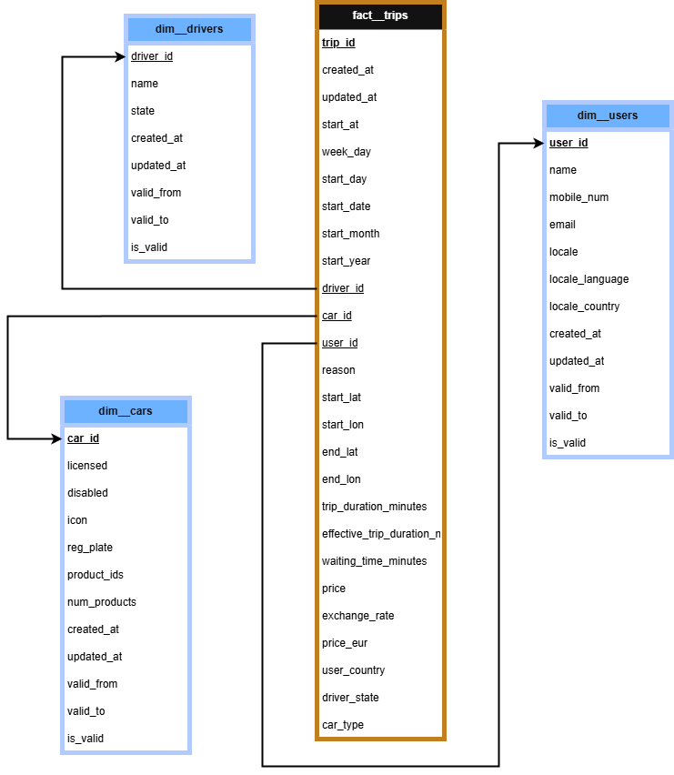
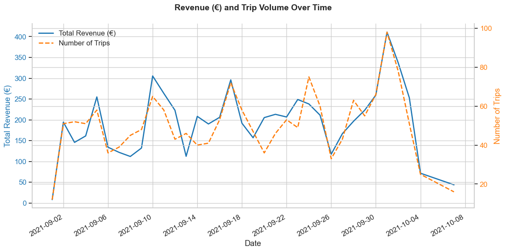
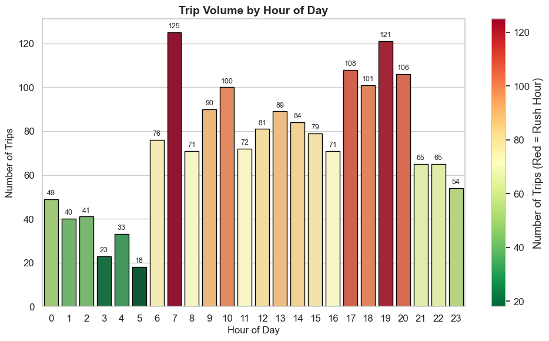
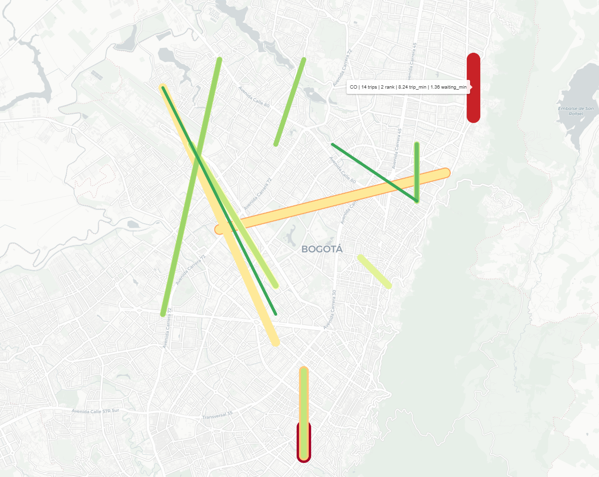
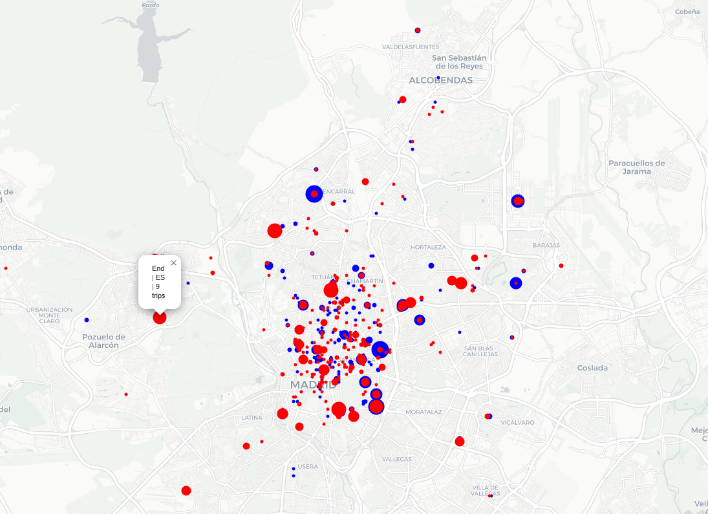

# 🚖 VTC Data Engineering Analytics Challenge

## 🚀 Introducción

Este repositorio contiene una solución completa (*end-to-end*) de **Data Engineering & Analytics** construida sobre un conjunto de datos de **VTC / ride-hailing** (conductores, usuarios, vehículos y viajes).

Aquí encontrarás todo lo necesario para poner en marcha un proceso que extrae, limpia y almacena los datos para su posterior visualización y análisis.

Toda la solución está contenerizada con **Docker** para garantizar la reproducibilidad y una puesta en marcha sencilla.

---
## ☁️ Arquitectura en cloud
La arquitectura que se explica a lo largo de este documento puede replicarse sin dificultad en un entorno cloud para ganar en escalabilidad, fiabilidad y automatización.

Hay un documento dedicado que lo describe en detalle:
[Diseño de la arquitectura en cloud](docs/README_cloud.md)

Ese documento cubre:
- Capa de cómputo (ECS / EKS)
- Capa de almacenamiento (S3, RDS)
- Orquestación (Airflow – MWAA)
- Logs y monitorización (CloudWatch)
- Principios de escalabilidad y tolerancia a fallos
- Gestión de secretos (Secrets Manager)

---

## Requisitos previos

- [Docker](https://www.docker.com/)
- [Docker Compose](https://docs.docker.com/compose/)
- Alternativamente: [Docker Desktop](https://www.docker.com/products/docker-desktop), que viene con todo lo necesario (Docker Engine, Docker Compose e interfaz gráfica)
- [Python](https://www.python.org/)
- *(Opcional)* [DBeaver](https://dbeaver.io/) o cualquier otro cliente SQL para explorar los datos.

Además, para poder ejecutar las celdas de los notebooks hay que instalar varias librerías de Python, por ejemplo con [pip](https://pypi.org/project/pip/).

---

## 🔐 Configuración de las credenciales

Las credenciales **no se guardan en el repositorio**. El proyecto las lee de un fichero `.env` local que está excluido en el `.gitignore`.

Antes de la primera ejecución, copia la plantilla y rellena los valores:

```bash
cp .env.example .env
```

Después edita el `.env` y define una contraseña propia en `PG_PASSWORD`. Puedes generar una con:

```bash
openssl rand -base64 24
```

Estas variables las consumen tanto `docker-compose.yml` como el código Python y el perfil de dbt, así que basta con definirlas una única vez. Si falta alguna, tanto Docker Compose como la aplicación fallarán al arrancar con un mensaje explícito en lugar de recurrir a un valor por defecto inseguro.

> ⚠️ Si cambias `PG_PASSWORD` cuando la base de datos ya está creada, tendrás que recrear el volumen (`docker compose down -v`), porque la contraseña queda fijada al inicializarse el volumen de PostgreSQL.

---

## ⚙️ Ejecutar el pipeline
### 1. Clonar el repositorio
```bash
git clone https://github.com/DiegoPrieto23/vtc-data-engineering-analytics.git

cd vtc-data-engineering-analytics
```

### 2. Comprobar que Docker está instalado y en marcha
```bash
docker compose version
```

### 3. Construir el entorno Docker
```bash
docker compose build
```
Por defecto, el proyecto levanta:
- Una base de datos PostgreSQL
- Un contenedor de aplicación que ejecuta la lógica de ETL / ELT (`main.py` + los modelos de dbt)

### 4. Ejecutar el pipeline completo (todos los modelos)
Para arrancar la base de datos y ejecutar el pipeline completo (todas las entidades: `drivers`, `users`, `cars`, `trips`):

```bash
docker compose up
```
Esto hará lo siguiente:
1. Arrancar el contenedor de PostgreSQL
2. Crear los esquemas (`raw`, `staging`, `core`, `analytics`)
3. Cargar los datos en bruto
4. Ejecutar todas las transformaciones de **dbt** y los pasos de modelado
5. Al terminar, los datos estarán listos para explorarse en la base de datos.

```bash
# Ejecución puntual (más ligera y rápida, porque los contenedores se eliminan al acabar)
docker compose run --rm app
```

### 5. Ejecutar modelos individuales
A veces interesa ejecutar el pipeline solo para una entidad concreta, como `drivers`.
```bash
docker compose run --rm -e PIPELINE_TARGET=drivers app
docker compose run --rm -e PIPELINE_TARGET=users app
docker compose run --rm -e PIPELINE_TARGET=cars app
docker compose run --rm -e PIPELINE_TARGET=trips app
```

### 6. Parar todo
```bash
docker compose down

# Parar y borrar los datos
docker compose down -v
```
---

## 🧭 Explorar y visualizar los datos

Puedes conectarte a la instancia de PostgreSQL con un **explorador de bases de datos** como DBeaver, PgAdmin4, etc.

**Datos de conexión:**

| Parámetro   | Valor                                     |
|-------------|-------------------------------------------|
| Host        | `localhost`                               |
| Puerto      | `5432`                                    |
| Base datos  | el valor de `PG_DB` en tu `.env`          |
| Usuario     | el valor de `PG_USER` en tu `.env`        |
| Contraseña  | el valor de `PG_PASSWORD` en tu `.env`    |

Una vez conectado, puedes navegar por los cuatro esquemas de la base de datos:

`raw` >> `staging` >> `core` >> `analytics`

---

## 🧩 Visión general de la arquitectura de datos

La base de datos se divide en **cuatro capas lógicas (esquemas)** por claridad, mantenibilidad y escalabilidad:

| Esquema | Propósito | Descripción |
|---------|----------|-------------|
| **raw** | Ingesta | Almacena los datos de origen sin modificar, tal cual se reciben. |
| **staging** | Transformación | Limpia, renombra columnas, deduplica y estandariza los datos antes del modelado. |
| **core** | Modelo listo para negocio | Contiene las tablas de hechos y dimensiones para analítica. Implementa la lógica de negocio y estadísticas adicionales. |
| **analytics** | Insights agregados | Tablas resumen de alto nivel y KPIs para reporting. |

---

## 🧱 Recorrido del desarrollo

Esta sección resume los pasos clave que se han seguido para construir el proyecto desde cero.

#### Paso 0: Análisis exploratorio inicial
- Descomprimir el `dataset.zip`
- Crear un primer notebook para hacer pruebas y conocer los datos

#### Paso 1: Extracción de los datos en bruto
- Se parte de un dataset comprimido (`dataset.zip`) con cuatro ficheros JSON: conductores, usuarios, vehículos y viajes.
- Se implementa un cargador de datos ([load_ndjson](src/utils/load_ndjson.py)) que parsea y repara las líneas JSON mal formadas (sobre todo en `trip.json`, que contenía caracteres `}` de más).
- Se convierten los JSON ya limpios a ficheros CSV para facilitar la ingesta en PostgreSQL.

#### Paso 2: Creación de la base de datos y diseño de esquemas (de local a Docker)
- Se diseña una base de datos PostgreSQL con cuatro esquemas principales: `raw`, `staging`, `core` y `analytics`.
- Se usa un script de Python (`db_init.py`) para crear la base de datos e inicializar los esquemas automáticamente.
- Después se pasa de local a Docker, con lo que `db_init.py` deja de ser necesario.

#### Paso 3: Ingesta de datos
- Ingestar los datos en bruto en el primer esquema de la base de datos (`raw`).
- Hacer las transformaciones de dbt para llevar los datos al esquema `staging`.
- Profundizar en el uso de dbt.

#### Paso 4: Core
- Crear las tablas de dimensiones y de hechos
- Implementar nueva lógica para `fact__trips`

#### Paso 5: Vistas de analytics
- Pensar KPIs, métricas y demás, y convertir esas ideas en vistas SQL.
- Ejecutar, corregir y mejorar las vistas

#### Paso 6: Notebooks
- Crear un dashboard analítico que represente toda la información de las vistas de analytics y demuestre el valor de los datos
- Documentar y corregir el notebook inicial
- Corregir `fact__trips`, ya que se nos había pasado que las fechas venían en UTC, así que se aplica un ajuste horario

#### Paso 7: Documentación
- Crear todos los README en markdown

---

## 🏗️ Modelado de datos

El esquema **core** está estructurado siguiendo un patrón de **esquema en estrella** (*star schema*):
<p align="center">
  
</p>

- `fact_trips.driver_id` → `dim_drivers.driver_id`
- `fact_trips.car_id` → `dim_cars.car_id`
- `fact_trips.user_id` → `dim_users.user_id`

### Tablas de hechos
Contienen eventos medibles, como los viajes.

- `fact_trips`: trip_id, created_at, updated_at, start_at, week_day, start_day, start_date, start_month, start_year, start_hour, driver_id, car_id, user_id, reason, start_lat, start_lon, end_lat, end_lon, trip_duration_minutes, effective_trip_duration_minutes, waiting_time_minutes, price, exchange_rate,
price_eur, user_country, driver_state, car_type

### Tablas de dimensiones
Contienen las entidades descriptivas relacionadas con los viajes.

- `dim_drivers`: driver_id, name, state, created_at, valid_from, valid_to, is_valid
- `dim_users`: user_id, name, mobile_num, email, locale, locale_language, locale_country, created_at, valid_from, valid_to, is_valid
- `dim_cars`: car_id, licensed, disabled, icon, reg_plate, product_ids, num_products, created_at, valid_from, valid_to, is_valid


Este diseño simplifica las consultas analíticas y permite agregaciones eficientes.

---

## 🧠 Decisiones de modelado

Esta sección resume las decisiones más relevantes tomadas al preparar y modelar los datos.

### 1. Tratamiento de los problemas de calidad en `trip.json`
Al cargar `trip.json`, varias filas provocaban errores de parseo.
Tras investigar el origen, se comprobó que:
- Un pequeño número de líneas estaba mal formado (por ejemplo, con una `}` de más), lo que rompía el parseo estándar de JSON.
- Para resolverlo se implementó un cargador propio, `load_ndjson`, con una función `repair_line` que:
  - Detecta las líneas mal formadas
  - Corrige o limpia los caracteres sobrantes
  - Permite ingestar todos los registros válidos sin perder el resto del fichero

Así se garantiza que unas pocas líneas defectuosas no detengan todo el proceso de ingesta.

### 2. Conflicto con una palabra reservada: user → user_id
Los datos de viajes contienen una columna llamada `user`.
Como `USER` (o similares) puede ser una palabra reservada en algunos dialectos de SQL, esto puede dar problemas al crear tablas o escribir consultas.

Para evitarlo, la columna se ha renombrado:
- user → user_id

Así se mantiene claro el significado y se garantiza que las sentencias SQL sigan siendo válidas y legibles.

### 3. Dimensiones con histórico (SCD tipo 2)

Las tablas de dimensiones (`cars`, `drivers`, `users`) contienen varias filas para un mismo ID a lo largo del tiempo.
En lugar de forzar un único registro «el más reciente», se ha decidido conservar el histórico completo:

- Tratamos estas dimensiones como *Slowly Changing Dimensions* de tipo 2 (SCD tipo 2).
- Para cada fila se añaden columnas de validez, como:
  - `valid_from` – cuándo pasó a estar activa esta versión
  - `valid_to` – cuándo dejó de estarlo (o NULL si es la vigente)
  - `is_current` – marca que identifica la versión activa

Esto nos permite:
- Responder preguntas «a fecha de» un momento concreto (p. ej. «¿quién era el conductor en ese momento?»)
- Mantener una visión histórica completa de los cambios en conductores, usuarios y vehículos.

### 4. Reducción de ruido en trips (lógica en el esquema staging)

El dataset de `trips` en bruto contiene varias filas por `trip_id`, que reflejan actualizaciones sucesivas de estado (asignación, progreso, cancelación, etc.).
Para que los datos sean utilizables en análisis, hay que quedarse solo con las **filas clave** que capturan transiciones de estado con significado.

Para cada `trip_id`, ordenado por `updated_at ASC`, conservamos:

#### ✅ Siempre:
- La **primera fila** del viaje (`is_first_row = TRUE`)

#### 🔄 Eventos de cambio de conductor o vehículo:
- La **primera fila** cada vez que cambia `driver_id` o `car_id` (`is_change_event = TRUE`)

#### 🏁 Lógica de cierre y cancelación del viaje:
- Si hay filas en las que `TRIM(reason)` no está vacío:
  - Conservar **solo la primera** de esas filas **en la que `price` no sea NULL ni NaN**
- Si todas esas filas tienen `price` NULL o NaN:
  - Conservar la **primera** fila con `reason` no vacío (aunque falte el precio)
- Si ninguna fila tiene `reason` no vacío, no se añade ninguna fila adicional más allá de las condiciones anteriores.

Esta lógica garantiza que:
- Cada viaje conserve una única fila de inicio, las filas relevantes de cambio de conductor/vehículo y una fila final de cierre (si procede).
- Se eliminen las actualizaciones redundantes y el ruido, reduciendo drásticamente el número de filas sin perder ningún evento relevante para negocio.

#### Filtrado por pares de coordenadas
- Del análisis exploratorio se desprende que en torno al 99,78 % de los viajes tienen exactamente dos pares de coordenadas (inicio y fin).
- Para mantener el modelo consistente y evitar registros extraños o incompletos:
  - Conservamos únicamente los viajes con exactamente dos pares de coordenadas en la tabla de hechos de `core`.
  - Los viajes que no cumplen esta regla siguen almacenados en la capa `raw`, pero quedan excluidos de `fact_trips`.

Esta lógica ayuda a reducir el número de filas preservando la información clave necesaria para el análisis de negocio.

### 5. Ajuste horario y conversión de divisa en fact_trips

Todas las marcas de tiempo originales de `staging__trips` están en UTC.
Para el análisis de negocio suele ser más útil trabajar en la hora local del usuario.

En el modelo `fact_trips`:
#### 1. Aplicamos el ajuste horario según el país del usuario
- Usamos `user_country` para desplazar las marcas de tiempo UTC a la zona horaria local.
- Se aplica a los campos temporales clave, como el inicio y el fin del viaje.
- Como resultado, las horas reportadas encajan mucho mejor con el horario comercial local y el uso real.

#### 2. Convertimos los precios a una divisa común
- Los precios de los viajes pueden venir en distintas divisas.
- Convertimos todos los importes a una divisa de referencia única (EUR) según una tabla de tipos de cambio.
- Esto facilita comparar viajes entre mercados distintos.

#### 3. Calculamos el tiempo efectivo de viaje y el tiempo de espera
A partir del histórico de eventos de cada viaje calculamos:
- Duración total del viaje (minutos):
  - Diferencia entre el primer evento (`first_created_at`) y el último (`last_updated_at`).

- Tiempo efectivo de viaje (minutos)
  - Diferencia entre la marca de tiempo del último evento y la del penúltimo.
  - Aproxima el tiempo que el usuario estuvo realmente en el vehículo, o el tramo «activo» principal del viaje.

- Tiempo de espera (minutos)
  - `waiting_time = duración_total - tiempo_efectivo`
  - Representa el tiempo de espera (buscando conductor, conductor en camino, estados intermedios, etc.).

### 6. Columnas derivadas (nuevas variables extraídas en el esquema core)

Durante el proceso de limpieza y transformación se han generado varias columnas nuevas a partir de los campos originales para ampliar la capacidad analítica. Estas columnas derivadas enriquecen los modelos de hechos y dimensiones con contexto temporal, geográfico y de negocio.

#### En `fact_trips`:
- **week_day** – Día de la semana como entero (lunes = 1, domingo = 7)
- **start_day** – Día del mes (1–31)
- **start_month** – Número de mes (1–12)
- **start_year** – Año extraído de la marca de tiempo de inicio del viaje
- **start_hour** – Hora del día (0–23)
- **start_date** – Fecha de calendario (AAAA-MM-DD)
- **price_eur** – Precio convertido a EUR con el tipo de cambio aplicable
- **exchange_rate** – Tipo de cambio aplicado para normalizar las divisas de los viajes
- **trip_duration_minutes**, **effective_trip_duration_minutes**, **waiting_time_minutes** – Duraciones derivadas de las diferencias entre marcas de tiempo

Estos enriquecimientos permiten hacer analítica de series temporales, detectar tendencias por día de la semana y comparar ingresos entre países en una divisa unificada.

---

## 📊 Notebooks: exploratorio y analítico

Para explorar los datos y las estadísticas calculadas puedes usar los notebooks de la carpeta `notebooks/`. Por ejemplo:
- 🔍 [notebooks/01_exploratory_data_analysis.ipynb](notebooks/01_exploratory_data_analysis.ipynb) – Análisis exploratorio inicial de los datos de `raw` y `staging`.
- 📊 [notebooks/02_analytics_dashboard.ipynb](notebooks/02_analytics_dashboard.ipynb) – KPIs y gráficos visuales basados en las capas `core` y `analytics`, como estos:
<p align="center">
  
</p>

<p align="center">
  
</p>


También puedes ver algunas de las salidas generadas en [notebooks/02_analytics_dashboard.ipynb](notebooks/02_analytics_dashboard.ipynb) en [esta carpeta](notebooks/outputs/). Para visualizar bien los HTML tendrás que descargarlos y abrirlos en un navegador, y verás algo como esto:
<p align="center">
  
</p>

<p align="center">
  
</p>

---

## 📂 Scripts SQL

En la carpeta `/sql` encontrarás un [script SQL](sql/analytics_script.sql) que define las vistas de analytics.
El fichero incluye:
- El código SQL para crear o refrescar la vista
- Una descripción de las métricas y su propósito (p. ej. «duración media de viaje por ciudad», «ingresos por conductor», etc.)

Estos scripts pueden ejecutarse directamente en PostgreSQL o incorporarse a dbt como modelos adicionales.

---

## 🔁 Planificación y escalabilidad

Cada modelo de datos está diseñado para poder ejecutarse **de forma independiente y segura N veces al día**.

Ahora mismo el proyecto no incluye planificación automática (Airflow, cron, etc.).
Aun así, puede reejecutarse manualmente en cualquier momento con los comandos de Docker descritos más arriba:
```bash
# Modelo individual
docker compose run --rm -e PIPELINE_TARGET=trips app

# Pipeline completo
docker compose run --rm app
```
Esta modularidad garantiza que:
- Cada reejecución actualice los datos correctamente sin generar duplicados (gracias a la lógica de insert/update).
- El pipeline pueda integrarse más adelante en DAGs de Airflow o en tareas cron para ejecutarse periódicamente.
- El sistema siga siendo escalable horizontalmente a medida que crezca el número de modelos.

---

## 🧠 Principios de diseño y buenas prácticas

- **Separación de responsabilidades** — Cada capa tiene un cometido propio (raw → staging → core → analytics).
- **Idempotencia** — Reejecutar los procesos de ETL no genera duplicados.
- **Modularidad** — Las transformaciones se construyen como funciones reutilizables y componibles.
- **Reproducibilidad** — Todo el entorno está dockerizado para garantizar consistencia.
- **Gestión de secretos** — Las credenciales se leen de variables de entorno; no hay valores por defecto ni contraseñas en el código.
- **Documentación desde el principio** — Cada esquema, tabla y transformación está explicado.

---

## ✅ Mejoras futuras

- Añadir **pipelines de CI/CD** para automatizar tests y despliegue.
- Ampliar la **capa de analytics** con KPIs y dashboards adicionales.

---

## 🧾 Resumen

Este proyecto muestra una solución de datos completa y orientada a producción:
- Extracción, limpieza y modelado automatizados
- Arquitectura de base de datos por capas, lista para analítica
- Totalmente contenerizada y portable
- Diseño escalable y preparado para cloud

Aunque el dataset es pequeño, la estructura sigue los principios que se aplican en el mundo real en equipos de data engineering a gran escala.
